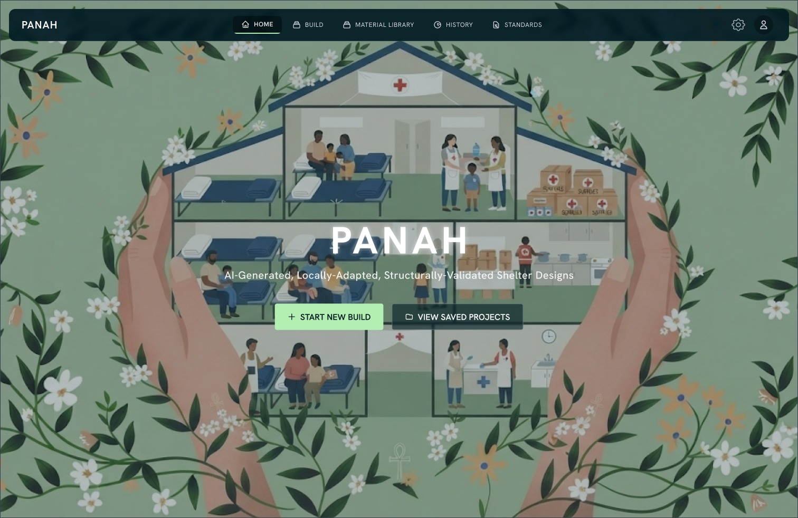
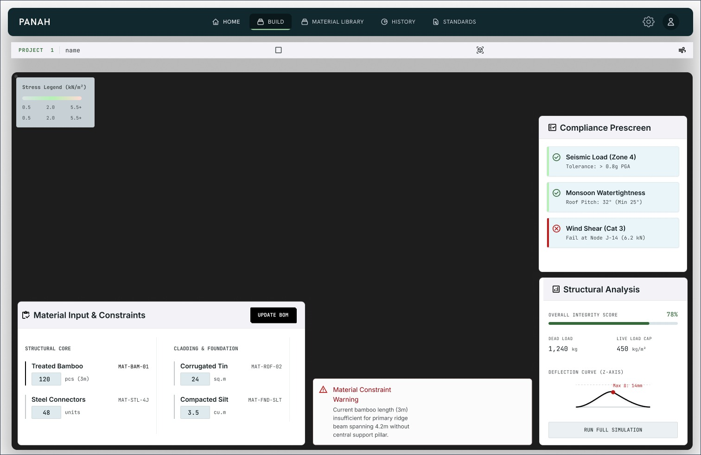
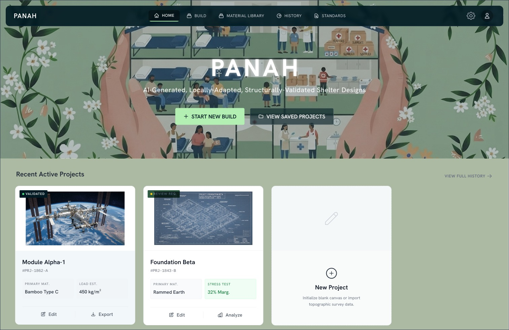
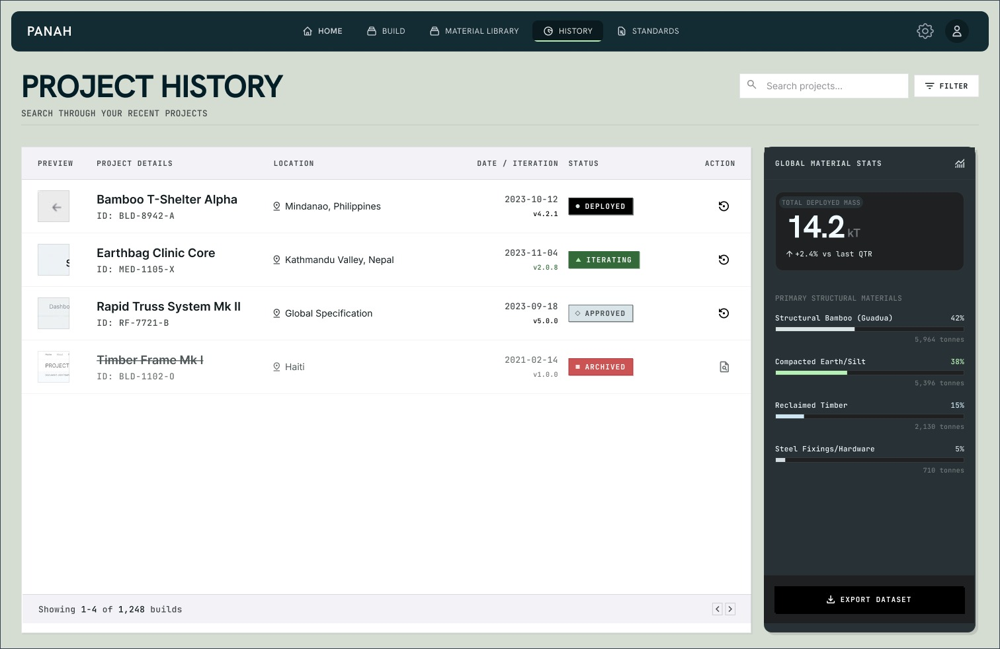
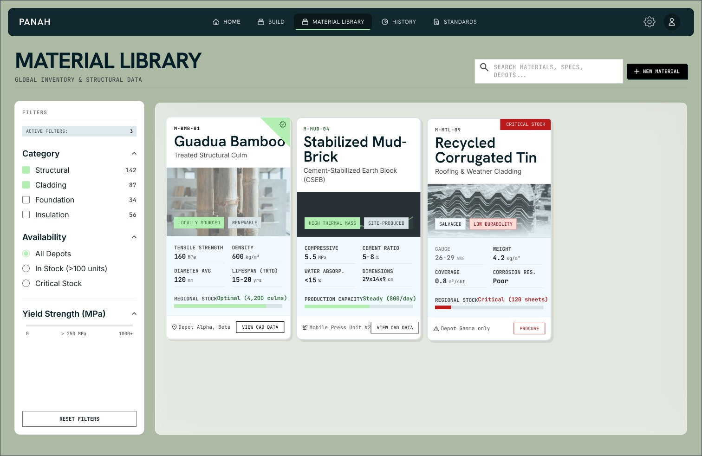
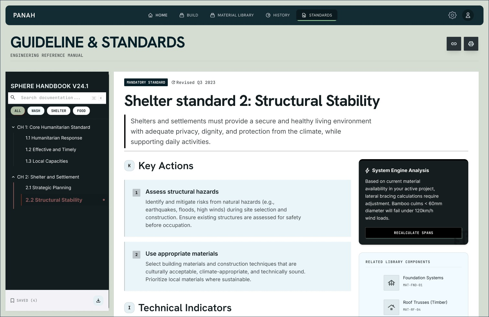
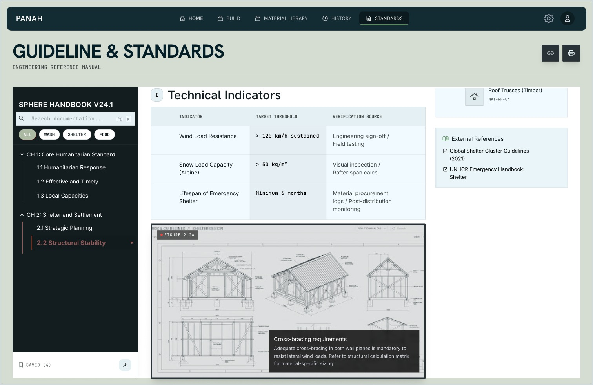

# Panagah (پناگاہ) — Humanitarian Shelter Assessment & Design Platform

A constraint-driven generative design system for humanitarian shelter assessment. Panagah collects field requirements, converts them into canonical constraint models, generates structured shelter-component candidates, builds parametric 3D geometry, and independently evaluates designs through a deterministic validation engine before presenting evidence to a human engineer.

## Architecture

```
Project → Site → Capture → Media → Observations / AI Analysis
Site → SiteProfile (draft→ready) + DesignSpecification (draft→ready)
        └──→ DesignGenerator → DesignCandidate → DesignVersion
ConstraintSet → LocalGenerationService → GenerationCandidate → DesignVersion
DesignVersion → StructuralAnalysis → Findings
DesignVersion → GeometryBuilder → Primitives
DesignVersion → Validation → EngineerReview
```

### Key Design Principles

- **Safety separation** — Generation never claims engineering safety; analysis, standards, and compliance are separate layers
- **Provider protocols** — AI and design generators use Protocol classes with mock implementations for MVP
- **Deterministic prescreening** — Rules use `NOT_EVALUATED` for missing evidence (never fake a pass)
- **Schema strictness** — All Pydantic models use `extra="forbid"` to reject unexpected fields
- **Content deduplication** — SHA-256 prevents duplicate uploads to same capture
- **Path traversal protection** — Storage keys validated to never escape root

## Setup

### Prerequisites

- Python 3.11+
- pip

### Installation

```bash
# Clone the repository
git clone <repo-url>
cd Panah

# Create virtual environment
python -m venv .venv

# Activate (Windows)
.venv\Scripts\activate

# Or activate (macOS/Linux)
source .venv/bin/activate

# Install dependencies
pip install -r requirements.txt
```

### Running the Server

```bash
uvicorn app.main:app --reload
```

The API will be available at `http://localhost:8000`

### Running Tests

```bash
python -m pytest tests/ -v
```

## API Reference

All endpoints are under `/api/v1`.

### Projects

| Method | Endpoint | Description |
|--------|----------|-------------|
| POST | `/projects` | Create a new project |
| GET | `/projects` | List all projects |
| GET | `/projects/{id}` | Get project by ID |
| PATCH | `/projects/{id}` | Update project |
| DELETE | `/projects/{id}` | Delete project |

### Sites

| Method | Endpoint | Description |
|--------|----------|-------------|
| POST | `/projects/{id}/sites` | Create a site |
| GET | `/projects/{id}/sites` | List sites |
| GET | `/projects/{id}/sites/{id}` | Get site |
| PATCH | `/projects/{id}/sites/{id}` | Update site |

### Captures

| Method | Endpoint | Description |
|--------|----------|-------------|
| POST | `/projects/{id}/sites/{id}/captures` | Create capture session |
| GET | `/projects/{id}/sites/{id}/captures` | List captures |
| GET | `/projects/{id}/sites/{id}/captures/{id}` | Get capture |

### Media

| Method | Endpoint | Description |
|--------|----------|-------------|
| POST | `/projects/{id}/sites/{id}/captures/{id}/media` | Upload photo/video |
| GET | `/projects/{id}/sites/{id}/captures/{id}/media` | List media |
| GET | `/projects/{id}/sites/{id}/captures/{id}/media/{id}` | Get media info |
| GET | `/projects/{id}/sites/{id}/captures/{id}/media/{id}/file` | Serve original file |

### Observations

| Method | Endpoint | Description |
|--------|----------|-------------|
| POST | `.../media/{id}/observations` | Create observation |
| GET | `.../media/{id}/observations` | List observations |
| PATCH | `.../media/{id}/observations/{id}/status` | Confirm/reject |

### AI Analysis

| Method | Endpoint | Description |
|--------|----------|-------------|
| POST | `.../media/{id}/analyze` | Run AI analysis |

### Materials

| Method | Endpoint | Description |
|--------|----------|-------------|
| POST | `/projects/{id}/materials` | Add material |
| GET | `/projects/{id}/materials` | List materials |
| GET | `/projects/{id}/materials/{id}` | Get material |
| DELETE | `/projects/{id}/materials/{id}` | Delete material |

### Site Profile

| Method | Endpoint | Description |
|--------|----------|-------------|
| GET | `/projects/{id}/sites/{id}/profile` | Get profile |
| PUT | `/projects/{id}/sites/{id}/profile` | Save profile |
| POST | `/projects/{id}/sites/{id}/profile/ready` | Mark ready |

### Design Specification

| Method | Endpoint | Description |
|--------|----------|-------------|
| GET | `/projects/{id}/sites/{id}/design-specification` | Get spec |
| PUT | `/projects/{id}/sites/{id}/design-specification` | Save spec |
| POST | `/projects/{id}/sites/{id}/design-specification/ready` | Mark ready |

### Design Candidates

| Method | Endpoint | Description |
|--------|----------|-------------|
| POST | `/projects/{id}/sites/{id}/design-candidates/generate` | Generate candidate |
| GET | `/projects/{id}/sites/{id}/design-candidates` | List candidates |
| GET | `/projects/{id}/sites/{id}/design-candidates/{id}` | Get candidate |
| PATCH | `/projects/{id}/sites/{id}/design-candidates/{id}/status` | Select/reject |

### Design Versions

| Method | Endpoint | Description |
|--------|----------|-------------|
| POST | `/projects/{id}/sites/{id}/design-versions/from-candidate/{id}` | Create from candidate |
| GET | `/projects/{id}/sites/{id}/design-versions` | List versions |
| GET | `/projects/{id}/sites/{id}/design-versions/{id}` | Get version |

### Validation

| Method | Endpoint | Description |
|--------|----------|-------------|
| POST | `/projects/{id}/sites/{id}/design-versions/{id}/validate` | Run validation |
| GET | `/projects/{id}/sites/{id}/design-versions/{id}/validation` | Get validation runs |

### Reviews

| Method | Endpoint | Description |
|--------|----------|-------------|
| POST | `/projects/{id}/sites/{id}/design-versions/{id}/submit-review` | Submit for review |
| POST | `/projects/{id}/sites/{id}/reviews/{id}/decision` | Record decision |
| GET | `/projects/{id}/sites/{id}/design-versions/{id}/reviews` | List reviews |

## UI Screenshots

| Screen | Description |
|--------|-------------|
|  | **Dashboard** — Project overview and quick actions |
|  | **Requirements** — Family size, site dimensions, environment |
|  | **Materials** — Local material inventory |
|  | **Generation** — Candidate design generation |
|  | **3D Workspace** — Interactive component inspection |
|  | **Validation** — Deterministic rule checking results |
|  | **Engineer Review** — Decision recording and audit |

## Tech Stack

- **Backend:** Python + FastAPI + SQLAlchemy + Pydantic v2
- **Database:** SQLite (development) / PostgreSQL (production)
- **AI:** Mock provider (MVP) / Alibaba Cloud Qwen (production)
- **Storage:** Local filesystem (MVP) / Alibaba Cloud OSS (production)
- **Testing:** pytest + httpx

## Project Structure

```
panah/
├── app/
│   ├── api/           # FastAPI routers (REST endpoints)
│   ├── ai/            # AI vision provider protocol + mock
│   ├── analysis/      # Structural analysis service
│   ├── compliance/    # Compliance reporting
│   ├── constraints/   # ConstraintSet schema + validator
│   ├── core/          # Config + database
│   ├── design/        # Design generator protocol + mock
│   ├── generator/     # Local generation service
│   ├── geometry/      # Geometry primitives + builder
│   ├── metadata/      # EXIF/GPS extraction
│   ├── models/        # SQLAlchemy ORM models
│   ├── schemas/       # Pydantic request/response schemas
│   ├── services/      # Business logic services
│   └── storage/       # File storage abstraction
├── docs/              # Documentation + screenshots
├── tests/             # Test suite
└── requirements.txt
```

## What This Is Not

- A fully autonomous structural engineer
- A replacement for professional engineering approval
- A complete building-code certification engine
- A full finite-element analysis platform

## License

Built for humanitarian shelter assessment. Use responsibly.
